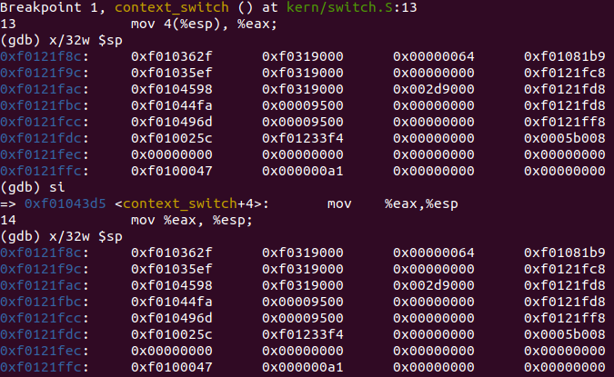
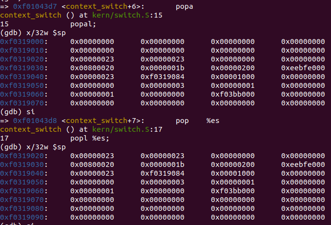
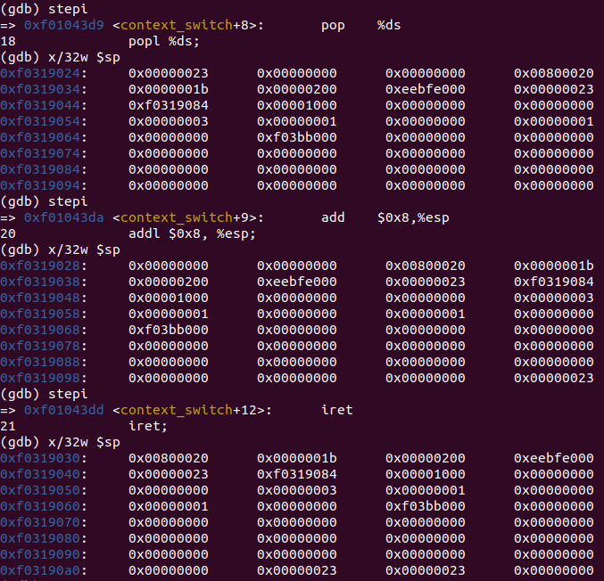
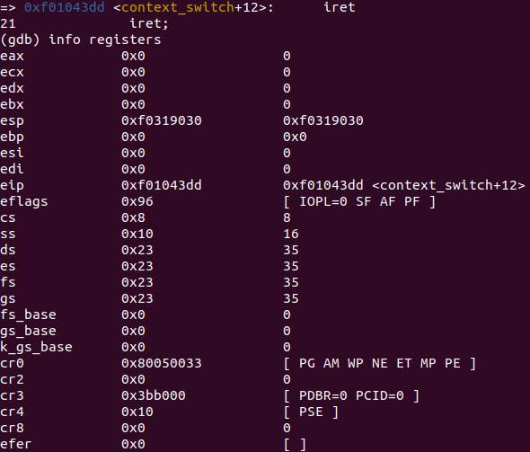
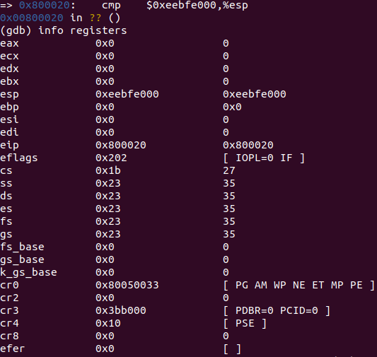

# sched

## Seguimiento de context_switch con gdb

Correremos el kernel con gdb poniendo un breakpoint en la función `context_switch` de `switch.S`. Una vez ahí veremos como cambia el stack instrucción a instrucción. Por último obtendremos un vistazo de todos los registros antes y después de ejecutar `iret`.

### Stack

En esta primera imagen podemos ver el estado de la stack cuando se llama a la función context_switch. Esta es la stack del kernel, lo cual tiene sentido ya que las direcciones en azul de la izquierda coinciden con las del mismo. Con las dos instrucciones `mov` lo que se hace es cambiar el `%esp` de la stack del kernel a la stack del modo usuario.

Luego podemos ver el contenido de la stack de usuario antes y después de ejecutar la instrucción popal, la cual popea de la stack los registros de propósito general (EAX, ECX, EDX, EBX, EBP, ESP, ESI y EDI). Como podemos ver en este caso esos registros están en 0. 

Por ultimo se puede ver como ejecutando `pop %es` se popea un elemento y se lo guarde en el registro de "extra segment" y lo mismo sucede con `pop %ds` para guardarlo en el data segment. Luego con `addl` se mueve el stack pointer 2 posiciones.

### Registros

Aquí podemos ver el estado de los registros antes y después de iret. Las diferencias tienen sentido porque algunos registros (como el stack pointer, code segment y data segment) contienen direcciones acorde al modo en que se encuentra la ejecución en ese instante y a la estructura de la memoria virtual del JOS.

## Implementación del sched 
Nuestra implementación de sched con prioridades consiste en la siguiente: 
Cada proceso al momento de ser creado se inicia con una prioridad de 1, la mejor prioridad. A lo largo de su vida su prioridad puede variar hasta alcanzar el máximo de 10, la peor prioridad. Estas prioridades son las que Sched tiene en cuenta a la hora de seleccionar el siguiente proceso a correr.  Para ello nuestro sched cada vez que es llamado en `sched_yield()`, busca dentro de todas los procesos corribles aquel con la prioridad más baja. Esto se hace con una lista circular que busca desde el siguiente proceso del actual comparando en todo momento las prioridades y localizando el proceso con la prioridad más baja dentro de la lista. En caso de encontrarse un proceso con la mejor prioridad, deja de buscar porque no hay ningún proceso que pueda llegar a albergar una mejor. Esto último permite una mejora en el performance, y no perder tiempo en seguir buscando. En el caso particular, de que no haya ningún otro proceso en estado corrible, y el actual todavía sea corrible, se corre el actual. En resumen, nuestro sched busca dentro de todas los procesos corribles el de mejor prioridad, en caso de no encontrar ningún y el actual es ejecutable selecciona este para correr. Si esta última condición no se cumple, entra en modo de espera.    
Como se mencionó antes, la prioridad de los procesos varía a lo largo de su vida. Las razones por las que pueda cambiar la prioridad son: el proceso consume su time slice, un boost o una system call. 
En caso de que un proceso consume su time slice, su prioridad se empeora. La justificación de este empeoramiento es que consumido un time slice, el proceso ya acaparó la CPU por determinado tiempo, y para ser justo con todos los procesos y que tengan todos las mismas oportunidad de ejecutarse, se baja la prioridad para darle más importancia a los que todavía no lo hicieron.  
Se barajaron varias posibilidades como medidas para determinar cuando un proceso merece una baja en la prioridad. Una de ellas es la cantidad de veces que un proceso se corre (lo que seria el apartado `env_runs` del Env). La idea era que cada vez que un proceso llegaba a cierta cantidad de corridas, al pasar el sched se le bajara la prioridad(con el uso del módulo). Esta se descartó dado que hay más llamadas `env_run()` (donde se aumenta la cantidad de envs y efectivamente un proceso se pone a correr), que llamadas al sched. Es decir, podía pasar que llegado al número de corridas en el cual se le tendría que bajar efectivamente la prioridad, el proceso sea llamado a correr desde un lugar independiente de sched, aumente la cantidad de veces que corrió y que al momento de llegar al sched, este no se entere de que llegó al número y por lo tanto espere a que sume a la próxima cantidad de corridas para bajarle la prioridad. Usar la cantidad de corridas para determinar cuando se le debe bajar la prioridad  traía estas ineficiencias y además, acarrea un problema más: muchas veces se aumenta la cantidad de corridas a un proceso solo por el uso de system calls, hecho que desemboca en una injusticia y bajando de la prioridad. Por estas razones se optó por usar el time slice, que resulta más justo y unificado a todos los procesos como unidad de medida.
Ahora bien, para que los procesos con una baja prioridad no queden al fondo del barril y jamás vuelvan a ser ejecutados (que no sufran starvation) al acaparar los procesos con mejor prioridad la CPU, se implementó un boost. El boost lo que hace es que cada cierto tiempo, vuelve a darle a todos los procesos la mejor prioridad. 
Con estas bajadas y subidas, se logra cierta justicia entre los procesos, que permite cierta igualdad de oportunidades al momento de consumir CPU, y atender de forma rápida a los procesos más efímeros.   

Algunas aclaraciones: 
-Se optó para que cada vez que se hace un fork, el procesos hijo se crea con la prioridad del padre. 
-Cambios en las constantes como `MAX_TIMESLICES_BOOST`  y  `MAX_ENV_TIME_SLICES`, que miden cada cuantos times slices se baja la prioridad o se sube hace el boost, cambian bastante el rendimiento en la ejecución  de las pruebas variando los cambios según la pc de

Implementación del historial: 
-El historial narra de forma cronológica los siguiente hechos: 
- Cuando se crea un proceso
- Cuando es selecciona un proceso por el sched
- Cuando se termina de ejecutar un proceso junto con la cantidad de veces que se corrió y la cantidad de time slice
Estas estadísticas y la forma en la que se muestran nos parecieron las más útiles para saber.